# Exercise 1: Get started with intelligent app development
In this exercise, you will be able to create chat assistant for the retail products to help your customers to learn more about the products. To create the product assistant, the user prompts are sent to the Azure Open AI to complete the chat based on the prompt and the product detail.

**Repo setup**
- Clone the repository from the main branch or fork it if you want to keep track of your changes if you have a GitHub account.
- Create your Codespaces by clicking on the Code button, your new Codespace will be opened in a new browser tab

 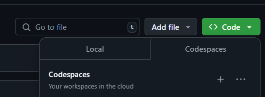

- View the project code in the Explorer blade inside VS Code Online

**Prompt context**
- You can set the prompt context with the product details so OpenAI provides valid responses in relation to the product being queried on.
- Go to the #region promptcontext under Exercise-1\devShopDNC\Controllers\ProductDetailsController.cs and view the prompt context setting.

**Prompt response style**
- Using System Chat Message, AI can be instructed to respond in a specific style like Shakespearean, pirate.
- Go to the #region systemmessages under Exercise-1\devShopDNC\Controllers\ProductDetailsController.cs , comment the current systemmessage and uncomment the line for new systemmessage that has the Shakespearean style response message embedded.
  
**Azure Sign In**
- Log into the provided Azure subscription in your environment using Azure CLI and on the Azure Portal using your credentials.
- Review the App Service Plan and the Azure Open AI service pre-provisioned in your subscription

### Deploy webapp to Azure App Service
- Right click on devshopDNC.csproj and select Open In Integrated Terminal

  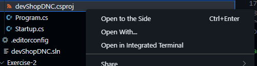

- **To publish the web app, run the command in the opened terminal, run dotnet publish -c Release -o ./bin/Publish**
- Right click on **bin--> Publish** folder and select Deploy to webApp option
  
- Press Deploy

  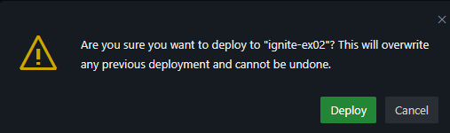  
  
- Select the already existing webapp for Exercise1
  
  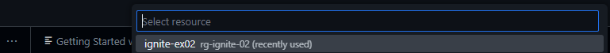
  
### Run the webapp
- Once deployed, click on the Browse button on the portal by going to the App Service web app view to view the web app

  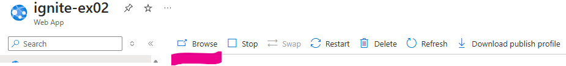

  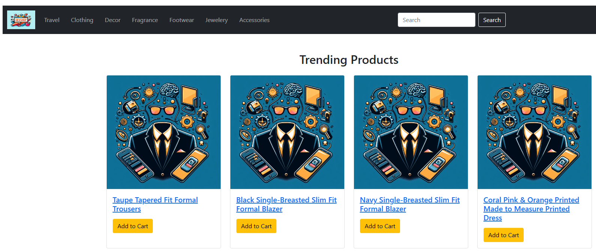  

### Enabling Managed Identity

- System Identity has been already enabled for your web app. To view, search for Identity on Settings menu. Under System Assigned tab, the Status will be set to **ON**. 

 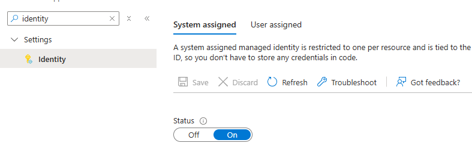

- As a next step, on Azure Open AI Resource, web app  "Role Assignment" has been set as Cognitive Services OpenAI Contributor.

### Connect to Azure Open AI (THIS STEP IS ALREADY DONE FOR YOU IN THIS LAB)

Now, the website is up and running. Lets connect with Azure OpenAI to get the Chat with AI Assistant integrated to the web app 

Add these appsettings to App Service web app.

- Go to Azure Open AI on the portal and open it in Azure AI Studio

 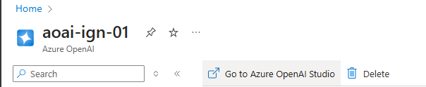  

- Deploy the gpt-4o model by going to Deployments and select gpt-4o Chat completion model and click Confirm

 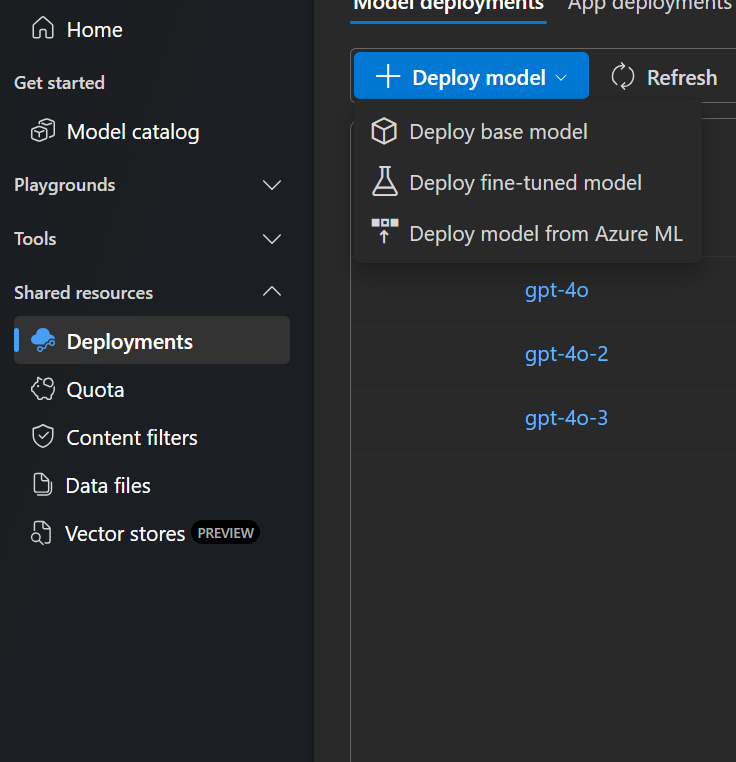

- Give the deployment name and select deployment type as "Global Standard"

 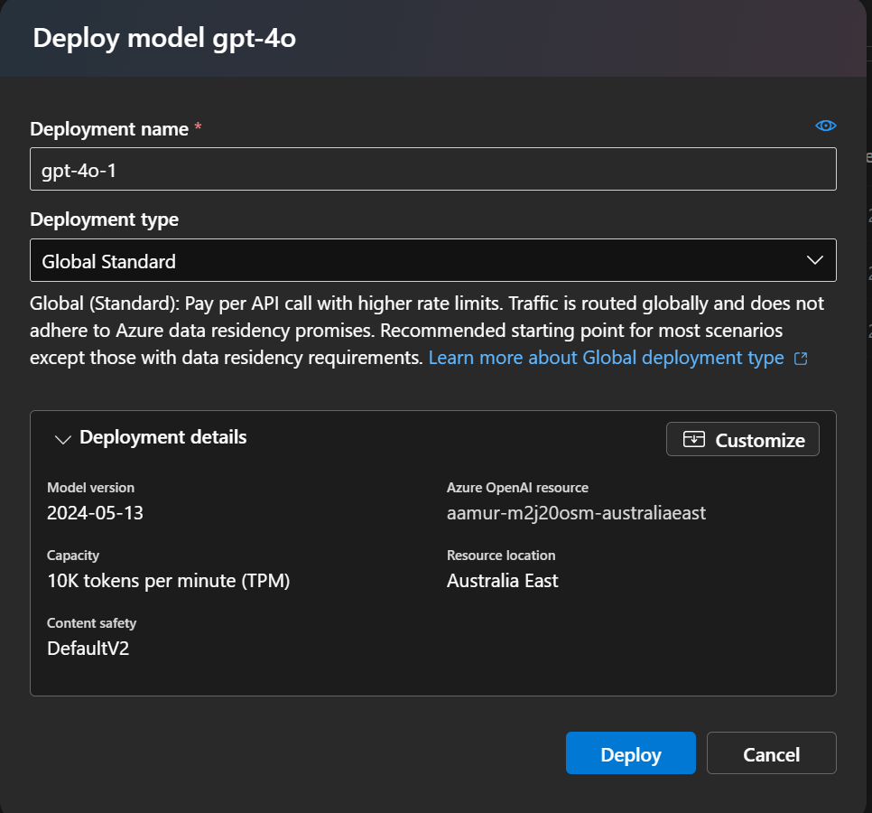 

- Switch back to the App Service configuration blade. Add the environment variables DEPLOYMENT_NAME and ENDPOINT. For ENDPOINT value, use TargetUri and for DEPLOYMENT_NAME value, use deployment name retrieved from the above step 

 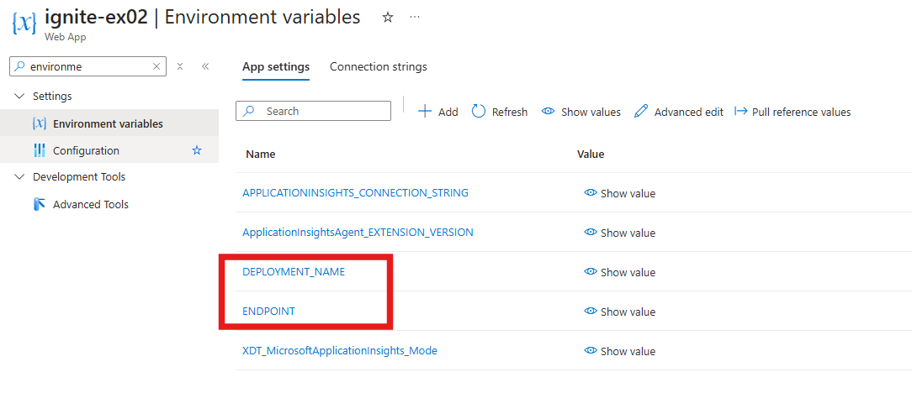

### Chat with AI Assistant
- Go to Clothing tab and select a product. 
- Click on **Chat with AI Assistant** and give an user message like "tell me more about the formal blazer"
- You should receive a chat response from the OpenAI model 

  
### Monitor the webapp
To monitor your web app, you can leverage the LogStream option under Monitoring section on the webapp portal view.

 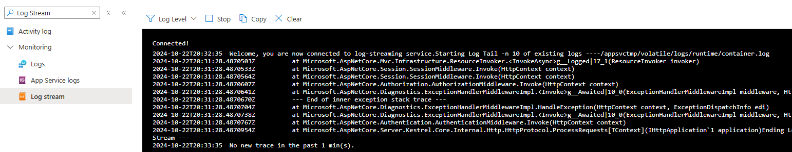

