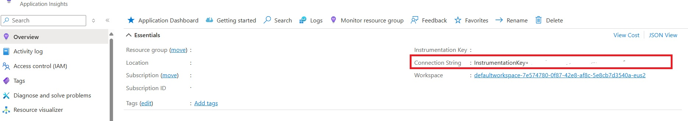
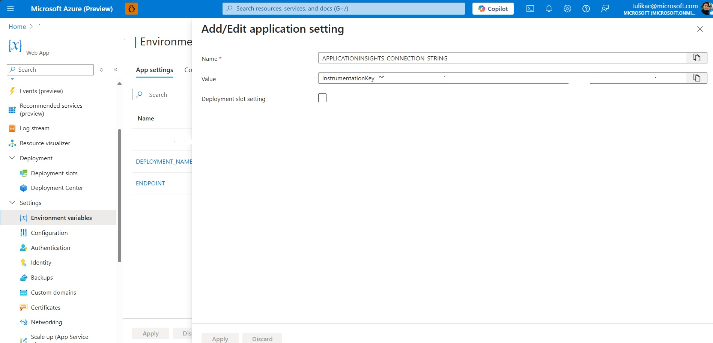
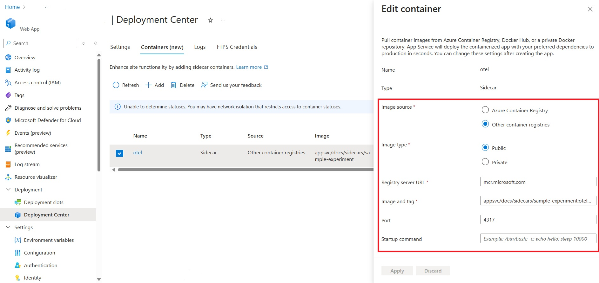
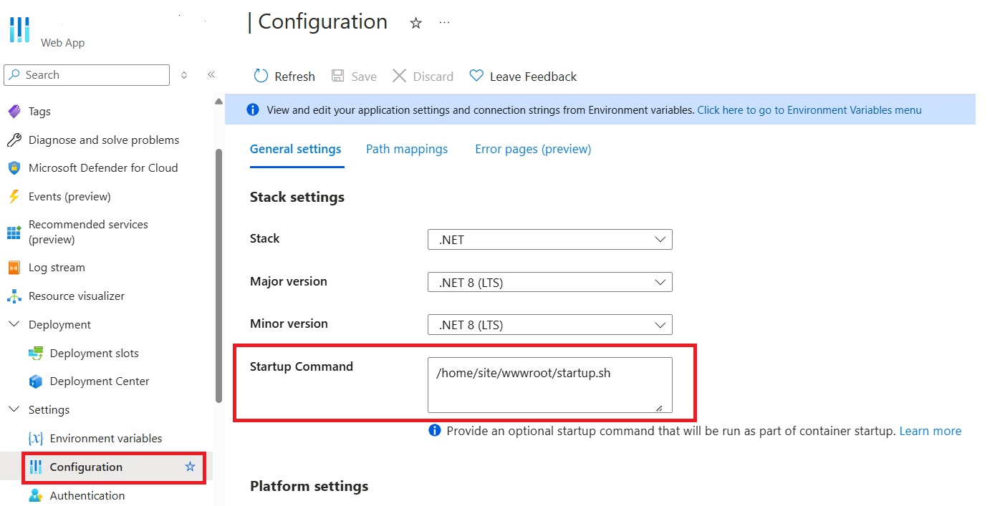
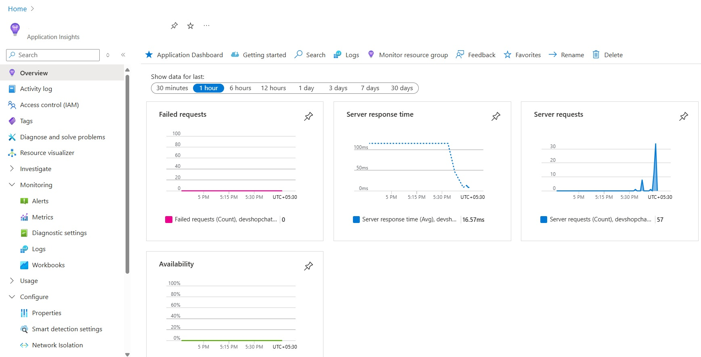

# **Exercise 3: Leveraging the Sidecar Pattern on Linux App Service for Observability**

In this exercise, you'll explore the power of the new [Sidecar pattern on Linux App Service](https://techcommunity.microsoft.com/t5/apps-on-azure-blog/a-glimpse-into-the-future-the-sidecar-pattern-on-linux-app/ba-p/4045680) by adding an OTEL (OpenTelemetry) sidecar to an existing .NET site. This sidecar will collect telemetry data and send it to Azure Application Insights, allowing you to monitor application performance and requests without modifying the application code. 

The Sidecar pattern offers a streamlined and modular way to extend the functionality of Linux App Service, enabling effortless integration with Azure Native ISV Partners like [Datadog](https://azure.github.io/AppService/2024/07/26/Using-Datadog-with-Sidecar.html), [Dynatrace](https://azure.github.io/AppService/2024/07/26/Using-Dynatrace-with-Sidecar.html), New Relic, and Elastic. By the end of this exercise, you'll understand the fundamentals of configuring an OTEL sidecar and gain the foundational steps needed to integrate with additional observability solutions.

This exercise not only illustrates a code-free observability enhancement but also demonstrates the flexibility and versatility of the Sidecar pattern, allowing your applications to scale and adapt with minimal friction.

## **Prerequisites**
1. The .NET web application you deployed in Exercise 1.
2. An Application Insights resource created and accessible within your Azure environment. 


## **Step 1: Retrieve the Application Insights Connection String**
1. **Log in to the Azure Portal**  
   Open the [Azure Portal](https://portal.azure.com/) and log in using the credentials provided for this lab.

2. **Navigate to the Resource Group**  
   - In the top search bar, search for **"Resource Groups"**.
   - Locate and click on the Resource Group where the resources for this lab are located.

3. **Copy the Application Insights Connection String**  
   - Within the Resource Group, find the **Application Insights** resource.
   - Open the Application Insights resource, and under **Settings**, find and copy the **Connection String**. This will be used to link your application to Application Insights.

    

## **Step 2: Configure the Application Environment Variables**
1. **Navigate to Your Web Application (Exercise 1 App)**  
   Go to the application you deployed in Exercise 1.

2. **Add the Application Insights Connection String**  
   - Go to **Configuration** -> **Environment Variables**.
   - Click **Add** to add a new environment variable:
     - **Name**: `APPLICATIONINSIGHTS_CONNECTION_STRING`
     - **Value**: Paste the connection string you copied from the Application Insights resource.
   - Save the changes.

   

## **Step 3: Set Up the OTEL Sidecar Container**
1. **Navigate to the Exercise-3 Folder in the Repository**  
   In the repository used for this lab, go to the **Exercise-3** folder. This folder contains the files necessary for OTEL integration:
   - `Dockerfile` - Contains the configuration for building the OTEL sidecar container.
   - `otel-collector-config.yaml` - The configuration file for OTEL collector to send data to Application Insights.
   - `startup.sh` - A script that downloads necessary OTEL instrumentation files for .NET applications.

2. **Review the Pre-Built OTEL Container Image**  
   For this exercise, we have pre-built the OTEL sidecar container image for you. The image is available at:
   ```
   mcr.microsoft.com/appsvc/docs/sidecars/sample-experiment:otel-appinsights-1.0
   ```

## **Step 4: Deploy the OTEL Sidecar to Your Web App**
1. **Navigate to Deployment Center**
   - Go to the **Exercise 1 Web app** in the Azure portal.
   - From the navigation pane on the left-hand, go to **Deployment Center**.
   - You will see a banner saying `Interested on adding containers to run alongside you app? Click here to give it a try`. Click on the banner to see the tab to add Containers.

2. **Add the OTEL Sidecar Container**
   - Under the **Containers (New)** tab, click **Add** to add a new container.
   - Fill in the following information:
     - **Image Source**: Other container registries
     - **Image Type**: Public
     - **Registry Server URL**: Enter `https://mcr.microsoft.com`
     - **Image and Tag**: Enter `appsvc/docs/sidecars/sample-experiment:otel-appinsights-1.0`
     - **Port**: Set to `4317` (the default port used by OTEL for exporting telemetry data).
   - Click Apply to save the settings.

     

## **Step 5: Set the Startup Command**
1. **Go to Configuration**
   - Navigate to the **Configuration** section in the Azure portal for your web application.

2. **Add the Startup Command**
   - In **Startup Command**, enter:
     ```
     /home/site/wwwroot/startup.sh
     ```
   - This command will run `startup.sh`, which downloads the necessary OTEL instrumentation files for .NET applications.

   

3. **Save and Restart the Application**  
   - Save the changes. The application may take a minute to restart as it loads the OTEL sidecar container.

## **Step 6: Verify Observability in Application Insights**
1. **Browse the Application**  
   - After the application restarts, open it and navigate through a few pages to generate some telemetry data.

2. **View Data in Application Insights**  
   - Return to the Application Insights resource in the Azure portal.
   - On the Overview page, you should now see the telemetry data reflecting the requests and interactions captured by the OTEL sidecar, giving you deeper insights into application performance.

   

---
