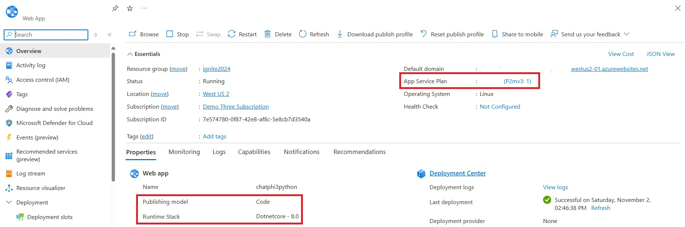
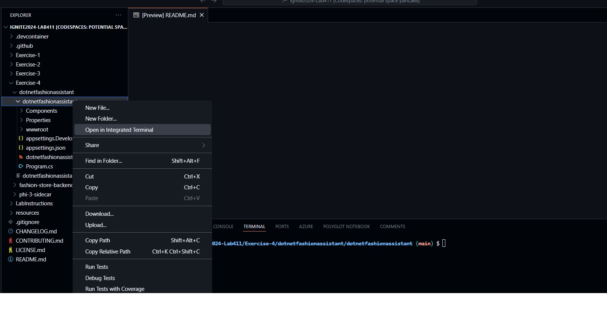
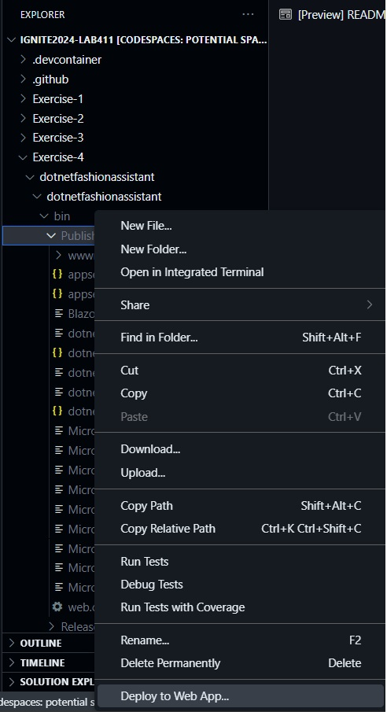

# Exercise 4: Running Phi-3 SLM as a Sidecar for Linux App Service

In this exercise, you will learn how to use the Phi-3 ONNX Small-Language Model (SLM) as a sidecar for your application.

## Overview of Phi-3 SLM

Phi-3 is a compact, efficient SLM designed to handle natural language processing tasks with minimal computational overhead. Unlike large language models (LLMs), SLMs like Phi-3 are optimized for scenarios with limited resources, providing quick and contextually relevant responses without high costs. Running Phi-3 on ONNX allows it to function effectively as a sidecar, bringing conversational AI capabilities to diverse environments, including Linux App Service. By integrating an SLM as a sidecar, developers can add sophisticated language features to applications, enhancing user engagement while maintaining operational efficiency.

In this exercise, you will implement a chat application that lets users inquire about products in your fashion store. Powered by Phi-3, the app will provide real-time responses, enhancing the customer experience with on-demand product information and styling suggestions.

## Navigating to the Partly Deployed Linux App Service

1. Open a browser and go to [Azure Portal](https://portal.azure.com) using the credentials provided.
2. Click on **App Service** in the top navigation bar.
3. From the list of apps, click on **Exercise-4** application.
4. On the **Overview** page, you can view some properties of the app:
   - The app runs on **P2mv3**, a Premium memory-optimized SKU offered by App Service. [Learn more about Premium SKUs here.](https://azure.microsoft.com/pricing/details/app-service/)
   - This application is deployed with **.NET 8**.

  
## Exploring the Deployment Center

1. Click on **Deployment Center** in the left navigation.
2. The application includes a Phi-3 sidecar as part of its setup.


## Code Exploration

In your lab fork, navigate to the folder `Exercise 4`. Inside, you will find two projects:

- **dotnetfashionassistant**: This is the frontend Blazor application.
- **phi-3-sidecar**: A Python FastAPI which exposes an endpoint to invoke the Phi-3 ONNX model, configured to run as a sidecar container. With the Sidecar feature, you can have the main application and the sidecar running different language stacks.

### Backend Project (phi-3-sidecar)

1. Open the `phi-3-sidecar` project.
2. Navigate to **model_api.py**:
   - Initialize the model in the constructor:
     ```python
      model_path = "/app/cpu_and_mobile/cpu-int4-rtn-block-32-acc-level-4"
      model = og.Model(model_path)
     ```
   - Phi-3 ONNX is an offline model, accessible from the filesystem. Here, the 4K CPU-based model is utilized.
   - Initialize the System  and Prompt:
     ```python
      chat_template = '<|system|>\nYou are an AI assistant that helps people find concise information about products. Keep your responses brief and focus on key points. Limit the number of product key features to no more than three.<|end|>\n<|user|>\n{input} <|end|>\n<|assistant|>'

      input = f"{data.user_message} Product: {data.product_name}. Description: {data.product_description}"
      prompt = chat_template.format(input=input)
     ```
   - The API method **predict** accepts three parameters – the user prompt, product name, and product description.
   - Pass the prompt to the model and stream the response token by token:
     ```python
      generator = og.Generator(model, params)
      .....
      while not generator.is_done():
                  generator.compute_logits()
                  generator.generate_next_token()
                  
                  new_token = generator.get_next_tokens()[0]
                  generated_text += tokenizer_stream.decode(new_token)
                  yield tokenizer_stream.decode(new_token)
     ```

3. Open the **Dockerfile**:
   - Use the Dockerfile to create the container image. In the Dockerfile, we are copying the model and exposing the container port.
     ```Dockerfile
      # Step 6: Copy the entire directory containing the ONNX model and its data files
      COPY ./Phi-3-mini-4k-instruct-onnx/cpu_and_mobile/cpu-int4-rtn-block-32-acc-level-4 /app/cpu_and_mobile/cpu-int4-rtn-block-32-acc-level-4

      # Step 7: Copy the API script into the container
      COPY ./model_api.py /app/

      # Step 8: Expose the port the app runs on
      EXPOSE 8000

      # Step 9: Run the API using Uvicorn
      CMD ["uvicorn", "model_api:app", "--host", "0.0.0.0", "--port", "8000"]
     ```

### Frontend Project (dotnetfashionassistant)

1. Open the **dotnetfashionassistant** project in VS Code.
2. Open **Program.cs** and configure the endpoint for the sidecar application:
   ```csharp
   builder.Services.AddScoped(sp => new HttpClient { BaseAddress = new Uri(builder.Configuration["FashionAssistantAPI:Url"] ?? "http://localhost:8000/predict") });
   builder.Services.AddHttpClient();
   ```
3. Open **Home.razor** and navigate to the `@code` section:
   - Call the backend API using `HttpRequestMessage`, passing in the user query, product name, and description:
     ```csharp
     var request = new HttpRequestMessage(HttpMethod.Post, configuration["FashionAssistantAPI:Url"]);
     request.Headers.Add(HeaderNames.Accept, "application/json");

     var queryData = new Dictionary<string, string>
     {
         {"user_prompt", message},
         {"product_name", selectedItem.Name},
         {"product_description", selectedItem.Description }
     };
     ```

   - Read and stream the response:
     ```csharp
     using (HttpResponseMessage responseMessage = await client.SendAsync(request, HttpCompletionOption.ResponseHeadersRead))
     {
         responseMessage.EnsureSuccessStatusCode();

         if (responseMessage.Content is object)
         {
             using (Stream streamToReadFrom = await responseMessage.Content.ReadAsStreamAsync())
             {
                 using (StreamReader reader = new StreamReader(streamToReadFrom))
                 {
                     char[] buffer = new char[8192];
                     int bytesRead;
                     while ((bytesRead = await reader.ReadAsync(buffer, 0, buffer.Length)) > 0)
                     {
                         response += new string(buffer, 0, bytesRead);
                         StateHasChanged();
                     }
                 }
             }
         }
     }
     ```

## Publishing the Frontend Application
1. Right-lick on the `dotnetfashioassistant` project in Codespace select `Open in Integrated terminal`.

  

2. To publish the web app, run the command in the opened terminal, run 
  ```bash
  dotnet publish -c Release -o ./bin/Publish
  ```

3. Right click on bin--> publish folder and select Deploy to WebApp option

  

4. Choose the `exercise4` app.

5. After deployment, wait a few minutes for the application to restart.

## Exploring the Application

Once the application is live, navigate to it and try asking questions like “Tell me more about this shirt” or “How do I pair this shirt?”


---

End of Exercise 4.
